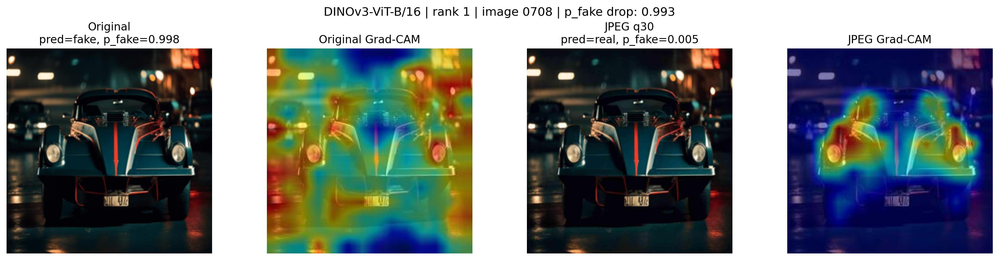

# Evaluating the Robustness of AI-Generated Image Detectors Under JPEG Compression with XAI

> **Team 5**  
> LU CHUNLAN (2024321094), BI YUEQI (2025323038)  
> Machine Learning and Programming — Yonsei University, Spring 2026

## Overview

This project investigates how JPEG compression affects the performance of AI-generated image (fake image) detectors, and whether XAI-guided analysis can diagnose the failure mechanism and inform robustness interventions.

### What "Robustness" Means in This Project

In this project, robustness refers to the stability of fake-image detectors under JPEG compression. Specifically, we evaluate three things:

- **Fake recall stability** — does JPEG compression cause the detector to miss more fake images?
- **TP→FN stability** — how many images shift from correct fake detection to incorrect real classification?
- **Detector confidence stability** — does the model's fake probability drop after compression?

We are not studying the robustness of JPEG compression itself. We study whether detectors can still correctly identify fake images after a common real-world transformation.

## Research Questions

| # | Question |
|---|----------|
| RQ1 | Does JPEG compression reduce fake-image recall across different detector architectures? |
| RQ2 | How do fake-to-real prediction shifts happen at the paired-image level? |
| RQ3 | Can XAI reveal what visual evidence is weakened after JPEG compression? |
| RQ4 | Do background suppression and LazyStrike-inspired interventions improve robustness, or do they reveal architecture-specific limitations? |

## Method

<!-- TODO: Replace the placeholder below with your flow diagram -->
<!-- Suggested format: PNG or SVG, showing Stage 1 (ResNet18 pipeline) and Stage 2 (cross-architecture comparison) -->

> **[Flow Diagram Placeholder]**  
> A two-stage flow diagram will be inserted here:
> - Stage 1: ResNet18 baseline → Grad-CAM diagnosis → Background Suppression
> - Stage 2: 3-architecture baseline comparison → Intervention transfer tests

### Stage 1: ResNet18 XAI-guided Pipeline
- Train ResNet18 baseline and observe JPEG-induced fake recall drop
- Use Grad-CAM to diagnose failure cases (heatmap correlation = 0.97)
- Apply Background Suppression using DeepLabV3 pseudo masks
- Result: JPEG fake recall improved from 81.33% to 86.67%

### Stage 2: Cross-architecture Comparison & Intervention Transfer
- Expand to ViT-B/16 and DINOv3-ViT-B/16 on the full dataset (~20K images)
- Paired prediction analysis to quantify fake-to-real shifts
- Test whether BG Suppression and LazyStrike-k1 transfer to ViT

## Key Results

### Baseline Comparison (12,005 test samples)

| Model | Orig Recall | JPEG Recall | Recall Drop | TP→FN |
|-------|------------|-------------|-------------|-------|
| ResNet18 | 93.45% | 91.12% | 2.33% | 144 |
| ViT-B/16 | 93.78% | 92.40% | 1.38% | 102 |
| DINOv3-ViT-B/16 | 97.45% | 93.33% | 4.12% | 247 |

### Intervention Transfer (ViT-B/16)

| Intervention | Orig Recall | JPEG Recall | Drop | TP→FN |
|-------------|------------|-------------|------|-------|
| Baseline | 93.78% | 92.40% | 1.38% | 102 |
| + BG Suppression | 95.50% | 92.50% | 3.00% | 183 |
| + LazyStrike-k1 | 95.63% | 93.57% | 2.07% | 136 |

### Key Findings

1. **JPEG compression reduces fake-image recall across all tested architectures.**
   ResNet18, ViT-B/16, and DINOv3-ViT-B/16 all show fake recall drops after JPEG q30 compression.

2. **Clean-image performance does not guarantee JPEG robustness.**
   DINOv3-ViT-B/16 achieves the strongest original fake recall, but it also shows the largest recall drop and the most fake TP→FN cases after compression.

3. **JPEG-induced failures are not limited to background bias.**
   XAI cases suggest that the lost evidence may include fine-grained textures, reflections, edges, lighting patterns, skin/hair details, and background cues. Background bias may be one part of the problem, but it does not explain all cases.

4. **Intervention effects are architecture-sensitive.**
   Background suppression improved the initial ResNet18 setting, but it did not transfer to ViT-B/16. The simplified LazyStrike-k1 intervention also changed model behavior but did not improve JPEG robustness.

5. **Future robustness methods should be both task-aware and architecture-aware.**
   Fake-image detection may require different robustness strategies for CNNs, supervised ViTs, and self-supervised DINO features.

## XAI Cases

Selected TP→FN visualization panels are in `results/xai_cases/`. Each panel shows original image, JPEG image, Grad-CAM overlays, and prediction probabilities.

<!-- TODO: Insert a representative XAI panel image here (e.g., DINOv3 0708) -->
<!--  -->

| Model | Case ID | Description |
|-------|---------|-------------|
| ResNet18 | 0882 | Bear — high-frequency fur texture weakened after JPEG |
| ResNet18 | 2354 | Desert house — structural edges and textures degraded |
| ViT-B/16 | 2839 | Lake scene — patch-level texture and reflection cues weakened |
| ViT-B/16 | 0279 | Crowd — complex scene and background cues affected |
| DINOv3 | 0708 | Sports car — reflection, lighting, and background bokeh cues weakened (prob_fake: 0.998→0.005) |
| DINOv3 | 4851 | Male face — skin and hair details compressed |
| DINOv3 | 1806 | Face in flames — high-frequency lighting and texture cues affected |

## Future Work: More Realistic AI Images and Robustness Benchmarks

As AI-generated images become more realistic, fake-image detectors may no longer rely on obvious artifacts. Instead, they may depend on more subtle cues, such as texture, lighting, reflections, edges, skin details, or compression-sensitive patterns. These cues can be easily weakened by common real-world post-processing operations, including JPEG compression, resizing, filtering, and platform recompression.

Therefore, future detector training should include more realistic image transformations, such as multiple JPEG quality levels, resizing, blur, noise, and social-media-style recompression. Future benchmarks should also evaluate not only clean-image accuracy, but also fake recall stability, TP→FN transitions, and confidence changes under different post-processing conditions.

A more complete benchmark should include newer and more realistic AI-generated images, multiple generator sources, multiple compression levels, and paired original/post-processed evaluation. This would better reflect real-world deployment, where fake images are rarely distributed in a clean, uncompressed form.

## Presentation Q&A

**Q: The title mentions "robustness." Robustness of what exactly?**

> A: In this project, robustness specifically refers to the stability of fake-image detectors under JPEG compression. We measure it through three indicators: whether fake recall drops, whether TP→FN errors increase, and whether detector confidence collapses when the same image is JPEG-compressed. We are studying the detector's robustness, not the robustness of the compression method itself.

**Q: Why did you focus on fake recall instead of overall accuracy?**

> A: In safety-sensitive scenarios, missing a fake image (false negative) is more dangerous than a false alarm (false positive). Overall accuracy can remain high even when many fake images are missed, because real images dominate the dataset. Fake recall and TP→FN transitions directly capture the failure mode we care about.

**Q: How is your paired evaluation different from standard evaluation?**

> A: Standard evaluation reports aggregate metrics like accuracy and F1 on a test set. Our paired evaluation tracks the same image under both original and JPEG conditions, allowing us to identify exactly which images flip from correct to incorrect predictions. This reveals per-image failure patterns that aggregate metrics can hide.

**Q: Why did background suppression work on ResNet18 but not on ViT?**

> A: ResNet18 processes images through convolutional feature maps where spatial regions (foreground vs. background) are directly represented. Suppressing background activations has a clear effect. ViT processes images as patch tokens with global self-attention, where the relationship between spatial position and semantic role is more complex. A method designed for CNN feature maps does not directly transfer to ViT patch representations. This suggests that robustness interventions need to be architecture-aware.

**Q: Does Grad-CAM prove that the model relies on background cues?**

> A: No. Grad-CAM provides qualitative evidence about where the model attends, but it does not establish causation. In our project, Grad-CAM serves as one piece of evidence in a multi-step reasoning chain: XAI observation → literature support (Fake or JPEG? and LazyStrike) → initial ResNet18 validation → expanded testing. The intervention results, not Grad-CAM alone, provide the stronger evidence.

**Q: How would this problem change as AI-generated images become more realistic?**

> A: As generators improve, fake images will have fewer obvious artifacts. Detectors will likely depend on more subtle cues — fine textures, lighting consistency, compression-sensitive patterns — which are exactly the kind of cues that JPEG compression and other post-processing can destroy. This means the JPEG robustness problem may become even more important in the future, and benchmarks should evaluate detector stability under realistic post-processing, not just clean-image accuracy.

## Repository Structure

```
├── README.md
├── requirements.txt
├── .gitignore
├── notebooks/
│   ├── 01_resnet18_baseline.ipynb
│   ├── 02_resnet18_bg_suppression.ipynb
│   ├── 03_vit_b16_baseline.ipynb
│   ├── 04_dinov3_vit_b16_baseline.ipynb
│   ├── 05_vit_lazystrike_k1.ipynb
│   ├── 06_vit_bg_suppression.ipynb
│   ├── 07_paired_analysis.ipynb
│   ├── 08_bg_suppression_paired_analysis.ipynb
│   └── 09_lazystrike_paired_analysis.ipynb
├── results/
│   ├── key_tables/
│   └── xai_cases/
└── slides/
```

## How to Run

1. Clone this repository
2. Install dependencies: `pip install -r requirements.txt`
3. Notebooks are numbered 01–09 and can be run in order
4. Notebooks were originally developed in Google Colab with GPU runtime (T4)
5. Due to file size, model checkpoints and full datasets are not included

## Notes

- JPEG compression applied at quality factor 30 (q30) using PIL/Pillow
- Dataset: ~20K images (binary fake/real), 12,005 test samples
- Metrics focus on fake recall, recall drop, and TP→FN transitions
